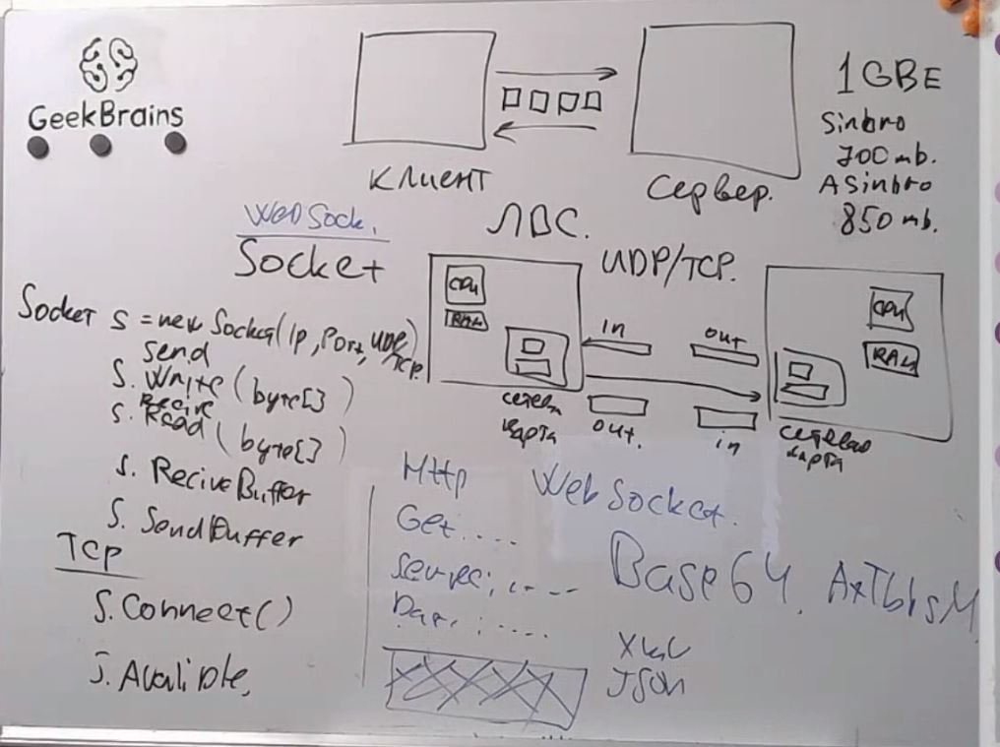
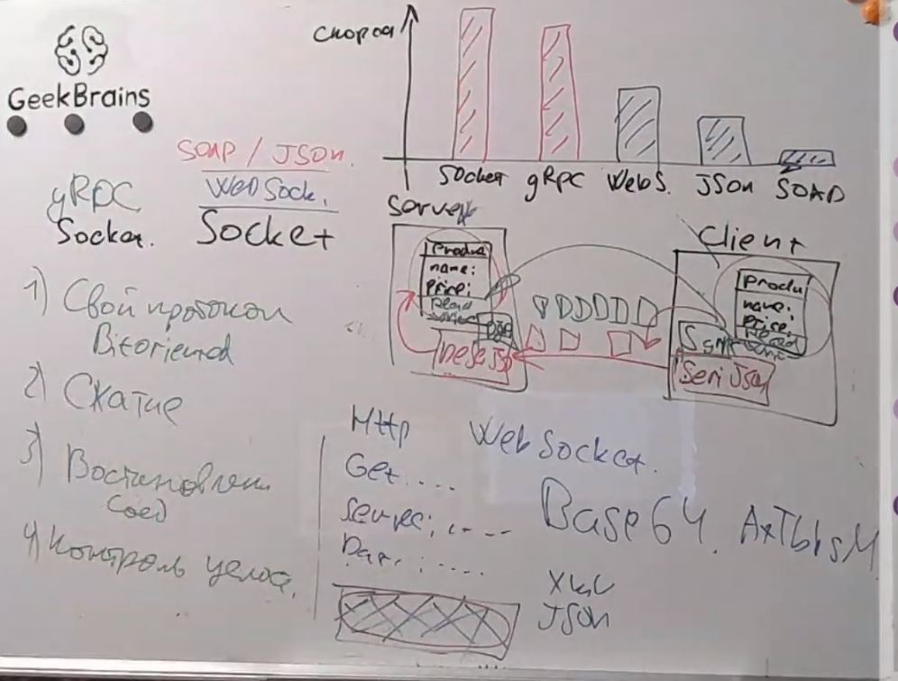
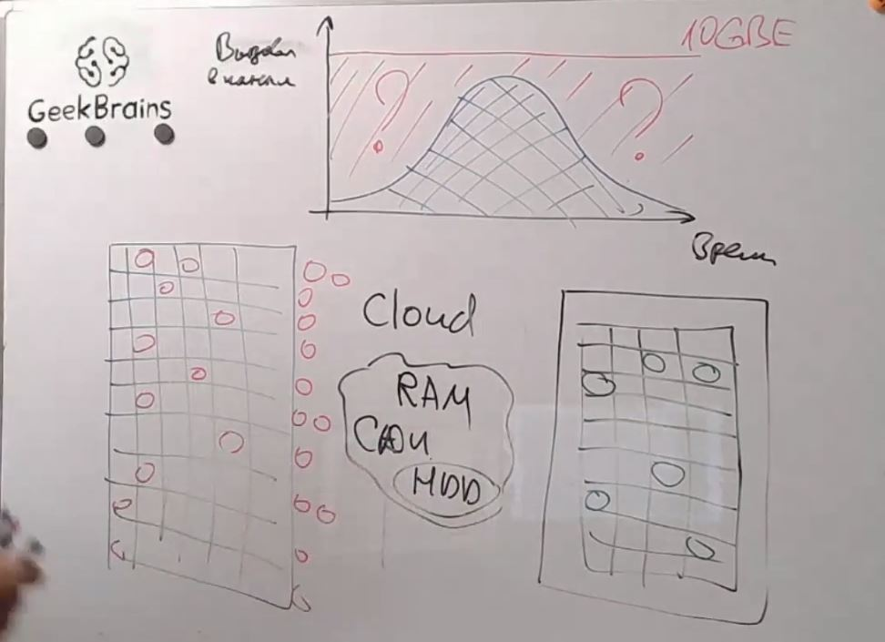
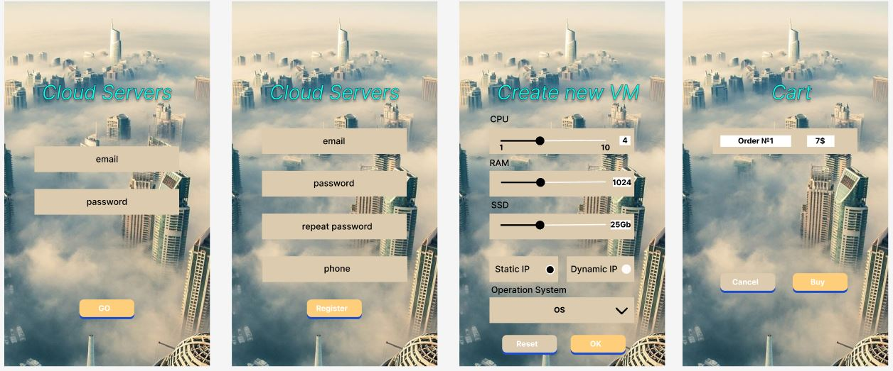

# Урок 9. Способы организации передачи данных между компонентами приложения, протоколы и API. REST, gRPC, очереди
## Classwork
### Развитие соединения интернета

### Разница в скорости соединения

### Облачные технологии

# Homework
Подготовить архитектурные документы к проекту заказа ресурсов в облаке:
1) Разработать экранные формы интерфейса для заказа ресурсов в облачном сервисе в https://www.figma.com/ 
или https://app.diagrams.net/.

2) Разработать полную ERD домена в https://www.dbdesigner.net/.

